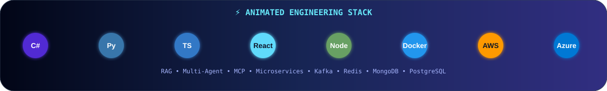

<div align="center">


<a href="https://readme-typing-svg.demolab.com/"></a>

<br/>


<br/><br/>

<a href="https://github.com/TheAshishPandy"></a>
<a href="https://instagram.com/theashishpandy"></a>
<a href="mailto:theashishpandy@gmail.com"></a>

</div>

---

## 🧑‍💻 About Me

<table>
<tr>
<td width="58%">

### Hey, I'm Ashish 👋

I build **scalable enterprise software and AI-native developer experiences**.

My sweet spot is where **software architecture + cloud + AI agents + automation** meet.

```yaml
role: Full-Stack Engineer / AI Engineer / Cloud Architect
location: Gurugram, India
focus:
  - AI / RAG / Multi-Agent Systems
  - MCP & Tool-Using Agents
  - Enterprise Architecture
  - Distributed Systems
  - Cloud-Native Applications
  - Developer Automation
mindset: "Build it clean. Automate it. Scale it."
```

</td>
<td width="42%" align="center">


</td>
</tr>
</table>

---

## 🎯 Focus Areas

<div align="center">

`AI / RAG` `Multi-Agent Systems` `MCP` `LLM Tools` `Microservices` `Distributed Systems` `Cloud Native` `Developer Automation` `Real-Time Systems` `Enterprise Architecture`

</div>

---

## ⚡ Animated Technology Stack

<div align="center">



<br/>


<br/><br/>


<br/><br/>


<br/><br/>


</div>

---

## 🧠 Architecture Playground

<div align="center">

```text
                         ┌─────────────────────┐
                         │     USER / APP       │
                         └──────────┬──────────┘
                                    │
                         ┌──────────▼──────────┐
                         │    API / GATEWAY     │
                         └──────────┬──────────┘
                                    │
              ┌─────────────────────┼─────────────────────┐
              ▼                     ▼                     ▼
       ┌────────────┐        ┌────────────┐        ┌────────────┐
       │ AI AGENTS │        │ MICROSERV. │        │  REALTIME  │
       └─────┬──────┘        └─────┬──────┘        └─────┬──────┘
             │                     │                     │
       ┌─────▼──────┐        ┌─────▼──────┐        ┌─────▼──────┐
       │ RAG / MCP  │        │ Kafka / API│        │ Socket.IO  │
       └─────┬──────┘        └─────┬──────┘        └────────────┘
             │                     │
       ┌─────▼─────────────────────▼─────┐
       │       DATA / VECTOR / CACHE      │
       │ MongoDB • PostgreSQL • Redis     │
       └─────────────────────────────────┘
```

</div>

---

## 🚀 Featured AI & Engineering Projects

<div align="center">

<a href="https://github.com/TheAshishPandy/MultiAgent"></a>
<a href="https://github.com/TheAshishPandy/MCPServer"></a>

<br/>

<a href="https://github.com/TheAshishPandy/SmartHireAgent"></a>
<a href="https://github.com/TheAshishPandy/chat-ai-ui"></a>

</div>

### 🤖 AI / Agent Engineering

`RAG` `Hybrid Search` `Semantic Search` `Multi-Agent` `MCP` `LLM Tools` `AI Automation`

### 🏢 Enterprise Engineering

`Microservices` `Event Driven` `GraphQL` `REST APIs` `Multi-Tenant` `RBAC` `Observability`

---

## 📊 GitHub Analytics — Tokyo Night

<div align="center">


<br/><br/>


<br/><br/>


</div>

---

## 🌆 3D Contribution City

<div align="center">


</div>

---

## 🐍 Contribution Activity

<div align="center">


</div>

---

## 🎮 Contribution Games

<div align="center">


<br/><br/>

`🐍 Snake` &nbsp;&nbsp; `🏓 Pong` &nbsp;&nbsp; `👾 Pac-Man` &nbsp;&nbsp; `🚀 Space Shooter`

</div>

---

## 🏆 Achievements

<div align="center">


</div>

---

## 📡 Currently Building

<div align="center">


</div>

---

## 🌐 Let's Connect

<div align="center">

<a href="https://github.com/TheAshishPandy">GitHub</a> •
<a href="https://instagram.com/theashishpandy">Instagram</a> •
<a href="https://mastodon.social/@theashishPandey">Mastodon</a> •
<a href="mailto:theashishpandy@gmail.com">Email</a>

<br/><br/>

<a href="https://buymeacoffee.com/theashishpandy"></a>

</div>

---

<div align="center">

### 💫 Build • Automate • Scale • Repeat


</div>
